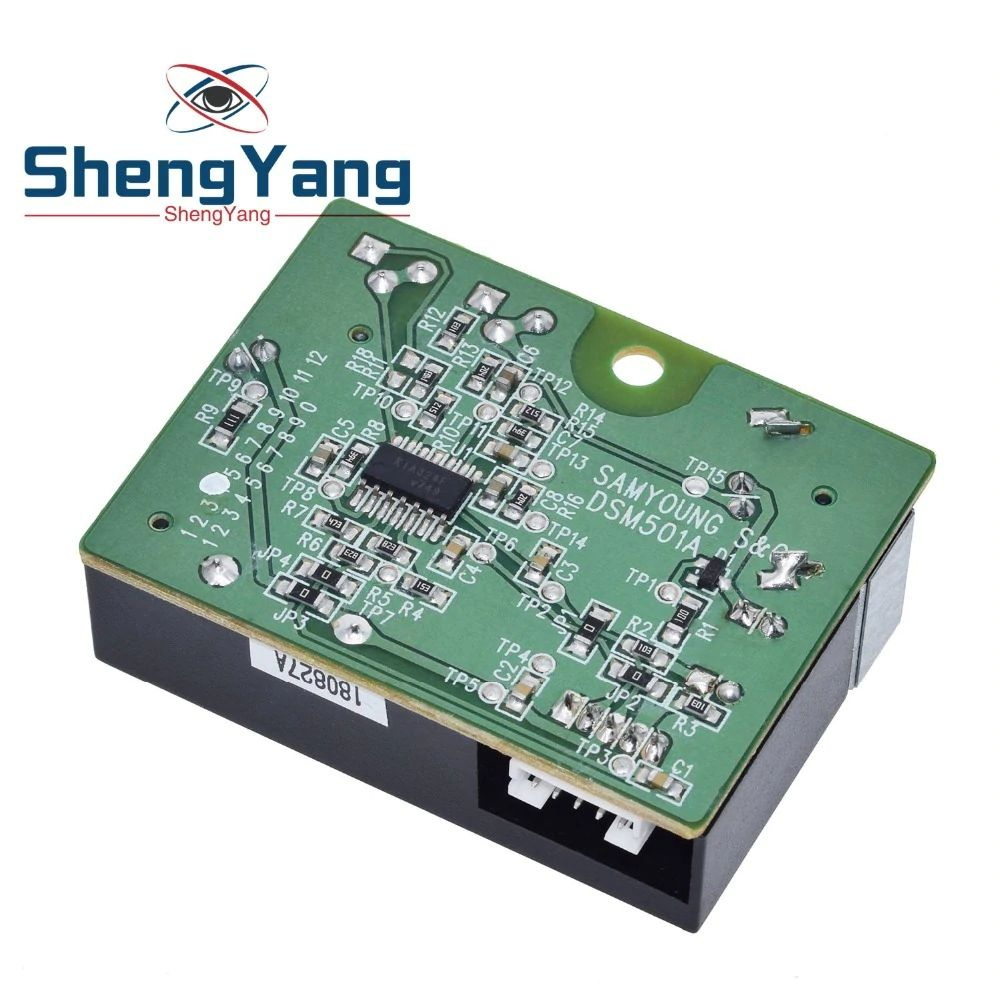
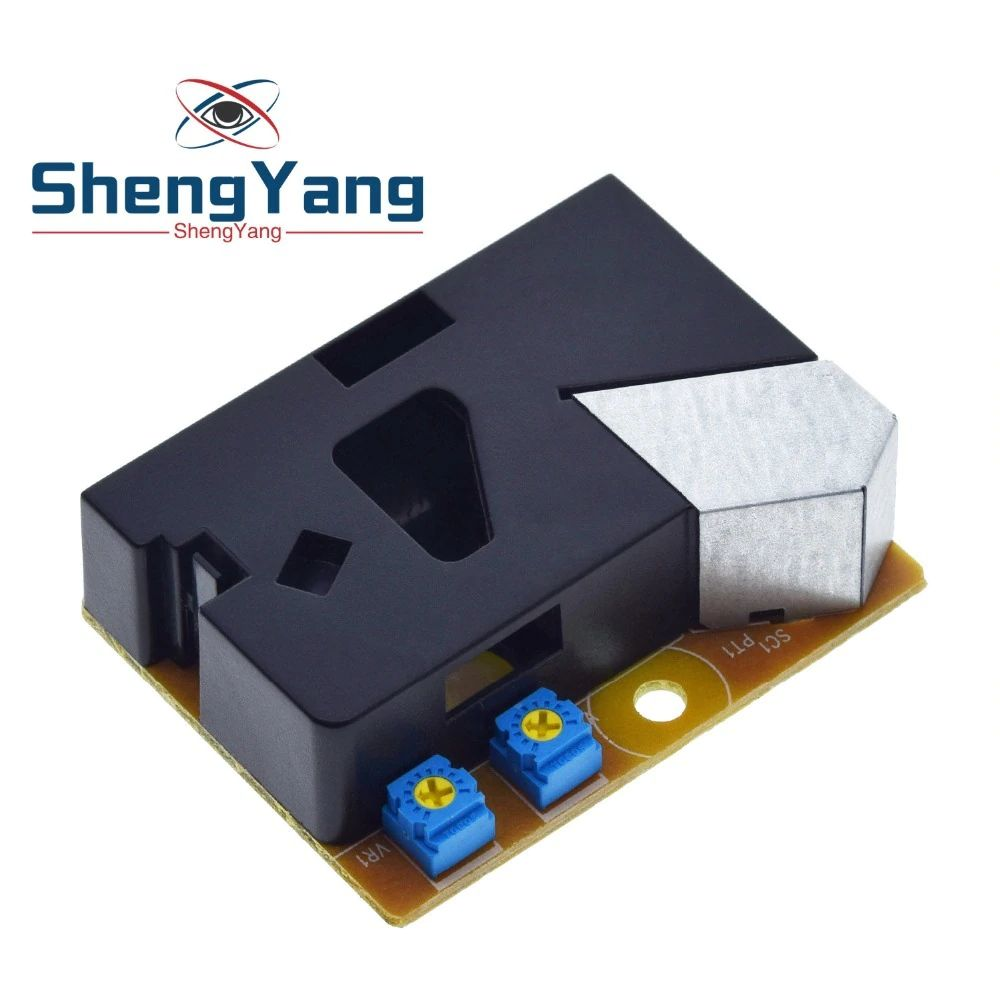
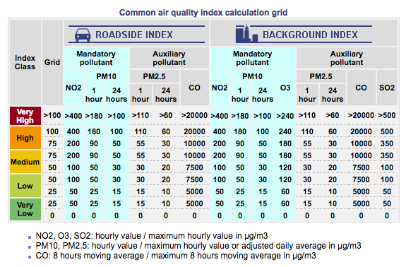
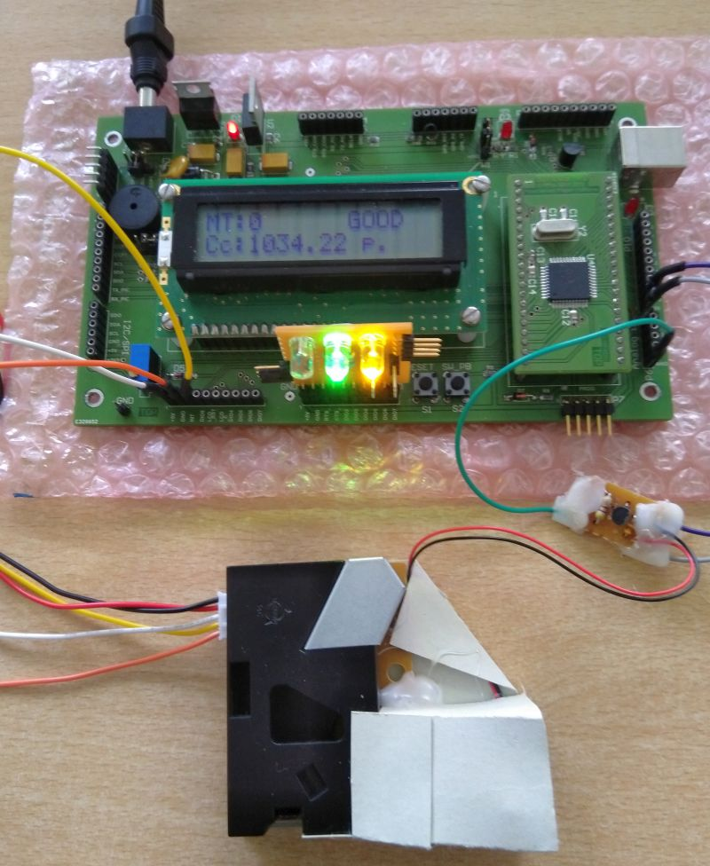
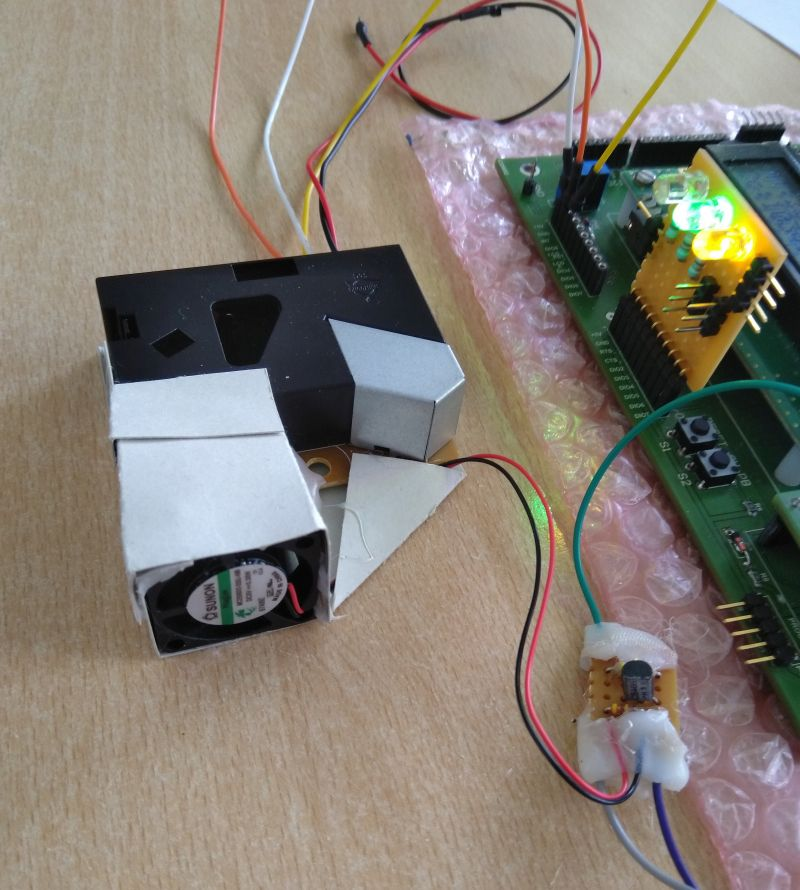

# Project - Air Quality measurement.

------

## Use a DSM501A Module and Simius card (PIC18F4550)

This project is based on the DSM501A module, which is a module that measures the density of particles in the air. It can measure particles on the order of 1 micron.

Depending on the measurement level, an indicator with three LEDs (red, yellow, green) informs the user of the ambient air quality (see table below).

### Sensor DSM501A connected to the Simius

